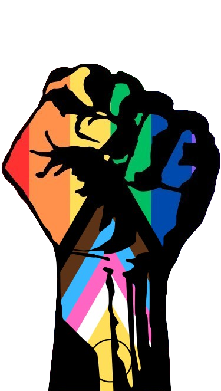

# FECAP - Fundação de Comércio Álvares Penteado

# Projeto Voice

    <a href= "[https://www.fecap.br/](https://github.com/2024-2-NCC3/Projeto2)">

## Nome do Grupo: The Boys

## Integrantes: <a href="https://br.linkedin.com/in/s%C3%A1tiro-gabriel-27081430b">Sátiro Gabriel de Souza Santos</a>, <a href="https://www.linkedin.com/in/flaviojose-santos/">Flávio Jose dos Santos</a>, <a href="https://www.linkedin.com/in/wellington-oliveira-5b46a0191/">Wellington De Aguiar Oliveira</a>,<a href="https://www.linkedin.com/in/marcelo-souza-36403b260/?utm_source=share&utm_campaign=share_via&utm_content=profile&utm_medium=android_app">Marcelo Henrique Sousa</a>

## Professores Orientadores: <a href="https://www.linkedin.com/in/victorbarq/">Victor Rosetti</a>, <a href="https://www.linkedin.com/in/vheltai/">Vinicius Heltai</a>, <a href="https://www.linkedin.com/in/katia-bossi/"> Katia Milani Lara Bossi</a>.

## Descrição

A violência contra mulheres,  e as violências ético-raciais, é um problema alarmante que precisa ser abordado. A importância da denúncia e a visibilidade dessas questões sociais são fundamentais para promover mudanças significativas.

### Objetivo do App
O aplicativo tem como objetivo criar um espaço seguro para denúncias, facilitar o acesso à informação e suporte, e promover a conscientização sobre questões ético-raciais.

### Funcionalidades do App
- Página de Denúncias
  - Formulário anônimo para envio de denúncias, com um link direcionando para o CRPIR (Centro de Referência de Promoção da Igualdade Racial).
  - Opção de selecionar o tipo de violência ou discriminação enfrentada.

- Portal Informativo
  - Artigos e materiais educativos sobre questões étnico-raciais e a violência contra mulheres, visando aumentar a conscientização e o entendimento.

### Parcerias e Apoio
O app contará com a colaboração de coletivos como Fecafro e Ruth Cardoso, fortalecendo a rede de apoio e amplificando a eficácia das iniciativas propostas.

## Referências
Uma das principais referências para o nosso projeto foi o **Centro de Referência de Promoção da Igualdade Racial (CRPIR)**, que desempenha um papel fundamental no acolhimento e na defesa das vítimas de violências étnico-raciais, além de promover ativamente a igualdade racial. Também buscamos inspiração nos coletivos **Fecafro** e **Ruth Cardoso**, que realizam esse trabalho de acolhimento dentro da faculdade. Nosso aplicativo foi desenvolvido com o intuito de ser uma ferramenta facilitadora para as vítimas, permitindo que elas façam denúncias de forma prática e segura.

Para entender melhor o impacto desse tipo de violência na vida das vítimas, assistimos a vídeos que mostravam relatos reais e abordavam as consequências emocionais e sociais. Esses materiais foram essenciais para aprofundarmos nossa compreensão sobre a importância de fornecer um suporte adequado e acessível, que é o objetivo central do nosso app.

## 🛠 Estrutura de pastas

-Raiz  
|  
|-->documentos  
    |-->Entrega 1  
    |-->Entrega 2  
    |-->Entrega 3  
    |-->Entrega 4  
|-->executáveis 
    |-->APK e AAB - Entrega 3  
    |-->APK e AAB - Entrega 4 
 |-->android   
|-->imagens  
|-->src  
 |-->Backend  
 |-->Frontend  
|readme.md  

📋 Licença/License

Este trabalho está licenciado sob <a href="https://creativecommons.org/licenses/by-nc-sa/4.0/?ref=chooser-v1" target="_blank" rel="license noopener noreferrer" style="display:inline-block;">CC BY-NC-SA 4.0</a>

🎓 Referências
Aqui estão as referências usadas no projeto.
- https://capital.sp.gov.br/web/direitos_humanos/w/igualdade_racial/rede_de_atendimento/270197
- https://www.instagram.com/coletivo.ruthc/
- https://www.instagram.com/fecafro/
- https://youtu.be/W6HmH8VFWsM?si=5GieeeDFE2JsqoaL
- https://youtu.be/7Af_xtOCN0w?si=7JJoQmbXwrv2hNsu

